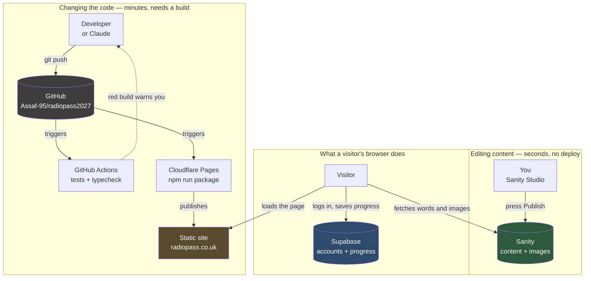

# How RadioPass is put together

Written for the person who owns it, not for a developer. If you read only one
thing, read the next paragraph.

**There are two completely separate ways a change reaches the live site.**
Editing *words and pictures* happens in Sanity and appears in seconds, with no
deploy and no developer. Changing *how the site works* happens in code, goes
through GitHub, and Cloudflare rebuilds the site. Almost every problem people
have with a setup like this comes from confusing the two — waiting for a deploy
that was never needed, or expecting a code change to appear because they pressed
Publish somewhere.

---

## The four services

| Service | Plain English | What breaks if it goes down |
|---|---|---|
| **GitHub** | The filing cabinet for the code, and the history of every change ever made. | Nothing immediately — the live site keeps running. You just can't publish code changes. |
| **Cloudflare Pages** | Takes the code from GitHub, builds the site, and serves it to visitors worldwide. | The site is offline. |
| **Sanity** | Where you log in to edit text and images. Also stores and optimises the images. | The site still loads, but shows the last content it was built with. |
| **Supabase** | Accounts, logins, and every candidate's progress, scores, flags and favourites. | Visitors can read, but can't log in or save progress. |

Two things worth understanding about that table:

**Sanity and Supabase are not competitors here.** Sanity holds *the content
everyone sees* — one copy, the same for every visitor. Supabase holds *each
person's own data* — your login, your score, which questions you flagged. They
never overlap.

**Cloudflare serves files, it doesn't run a server.** The site is a folder of
static files. That's why it's fast and cheap, and it's why there is no `/api`
on the live site — anything dynamic goes directly from the visitor's browser to
Supabase or Sanity.

---

## How a change travels

Read it as three separate loops. The top one is you, editing. The middle is code
being published. The bottom is what happens when someone visits. **Only the
middle loop needs a build.**

---

## Current status

The migration to Sanity is partly done. This is where it actually stands, so
the diagram above doesn't mislead you:

| Piece | Status |
|---|---|
| Cloudflare Pages building from GitHub | Built, ready to connect in the dashboard |
| CI gate — tests on every push | Live |
| Sanity client + image optimisation | Built |
| Sanity schemas (what you can edit) | Built |
| Content actually moved into Sanity | **Not yet** — needs your Sanity project ID |
| Pages reading from Sanity | **Not yet** |
| Lesson prose separated from simulation code | **Not yet** — the largest remaining piece |

Until the last three are done, content edits still go through the **existing
admin pages** backed by Supabase (`/admin`, `/anatomy/admin`), which work today.

Two things will never move into Sanity, and this is deliberate:

- **The Structure Atlas** has no records to move. It is rebuilt from the anatomy
  questions every time the page loads. Edit the questions and the Atlas follows.
- **The simulations** — the CT gantry, the ultrasound lab, all 18 of them — are
  programs, not text. Their surrounding words will move; the simulations stay
  code.

---

## The folders

### Top level

| Folder | What it is |
|---|---|
| `radiopass-website/` | **The application.** Everything visitors see. |
| `studio/` | **The editing interface.** Deploys separately to Sanity's servers. |
| `docs/` | Deployment and handover notes. |
| `brand/` | Logos and brand assets. |
| `archive-historical/`, `ANATOMY CLAUDE/`, `skull frams/` | Old backups. Nothing reads them. Safe to ignore. |
| `CLAUDE.md` | Project context, read automatically at the start of every AI session. |
| `architecture.md` | This file. |

### Inside `radiopass-website/src`

| Folder | Purpose |
|---|---|
| `anatomy/` | The whole anatomy half — cases, marking, the Atlas, the admin editors. The largest area. |
| `qbank/` | The physics question bank, mock exams and progress tracking. |
| `physics2/` | The physics course: sections, lesson content and the simulation components. |
| `labs/` | The interactive laboratories — X-ray, CT, nuclear medicine, mammography. |
| `mri/`, `mri5/` | The MRI module and its viewers. |
| `us/` | The ultrasound laboratory. |
| `portal/` | The home page and the access gate that decides what a visitor may read. |
| `design/` | The shared visual system — colours, type, layout, the site shell. |
| `lib/` | The plumbing: Supabase, Sanity, authentication, access rules. |
| `home/`, `physics/`, `clinical/` | Landing pages and smaller features. |
| `assets/` | Images compiled into the app itself, rather than served from a CDN. |

---

## Maintenance guide

### Publish a content change

1. Go to your Studio (`radiopass.sanity.studio`) and log in.
2. Edit the text or swap the image.
3. Press **Publish**.

It's live in seconds. **No deploy. Don't touch GitHub.** Work you haven't
published stays private to you, which is what lets you write something over
several days without candidates seeing it half-finished.

### Replace an image

In the Studio, open the case or page, click the image, choose **Replace**, and
upload. Then **Publish**.

Two rules that matter:

- **Crop out patient identifiable data before uploading.** The image is served
  publicly from a CDN once published.
- Don't resize or compress it first. Upload the best version you have — the
  system generates every size the site needs and picks the best format for each
  visitor's browser. Uploading a small image only limits quality.

To take a film down without losing the question, use **Film withdrawn** rather
than deleting the case. The question, its answers and its teaching all survive,
and you can bring the film back.

### Add a lesson

Half in the Studio, half in code, and the split is deliberate:

1. In the Studio, create a **Physics lesson**. Write the title, opening, and one
   **step** per idea.
2. Keep each step to a single concept. A learner should never scroll while
   reading one idea against its diagram.
3. If a step needs a simulation, a developer registers it in code and gives you
   its key. You can rewrite every word around it; you can't break it.
4. **Publish.**

### Roll back a bad deploy

Cloudflare dashboard → your project → **Deployments** → find the last good one →
**Rollback to this deployment**. Live again in seconds.

This only applies to *code*. To undo a *content* change, open the document in the
Studio, use its **History**, and restore the earlier version.

### Common problems

**"I published but nothing changed."**
Hard-refresh the page (`Cmd+Shift+R`). If it still shows the old text, check the
document actually says Published rather than sitting as a draft.

**"The site works but nobody can log in, and progress isn't saving."**
Cloudflare is missing its environment variables. `VITE_SUPABASE_URL` and
`VITE_SUPABASE_ANON_KEY` must be set in **Settings → Environment variables** for
*both* Production and Preview, and the site redeployed afterwards — they're read
when the site is built, so an existing deployment won't pick them up. This is the
single most likely thing to go wrong, because the file holding those values is
deliberately kept out of GitHub.

**"Replacing an image says 'new row violates row-level security policy'."**
Your login has expired even though the page still looks signed in. Sign out, sign
back in, try again.

**"A deep link like /anatomy/atlas gives a 404."**
The `_redirects` file didn't reach the build. It lives in
`radiopass-website/public/` and must appear in the published output.

**"The build failed on Cloudflare."**
Check the build log. The two usual causes are the **Root directory** not being
set to `radiopass-website`, and the Node version — which comes from
`radiopass-website/.nvmrc`.

**"Something looks broken and I don't know what changed."**
GitHub records every change with an explanation. Cloudflare records every deploy.
Between them you can find what changed and when, and roll back.
