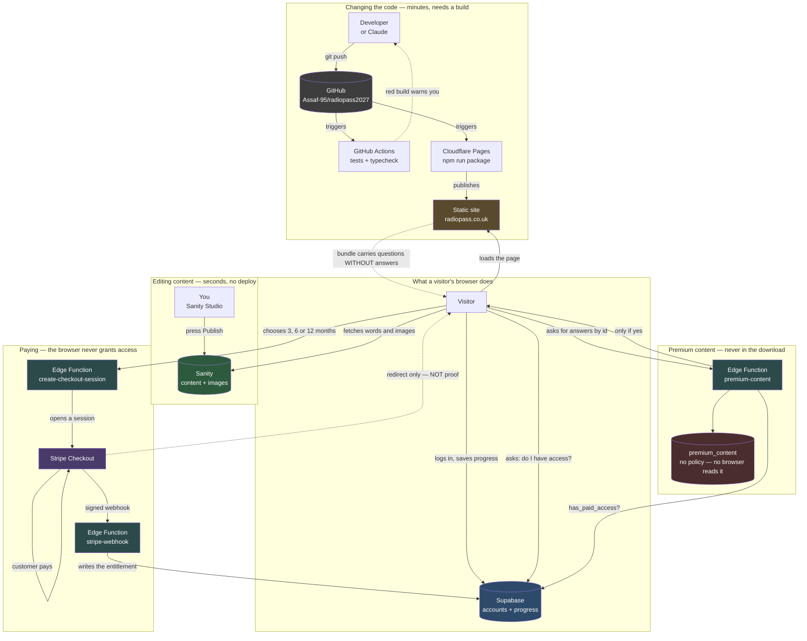

# How RadioPass is put together

Written for the person who owns it, not for a developer. If you read only one
thing, read the next paragraph.

**There are two completely separate ways a change reaches the live site.**
Editing *words and pictures* happens in Sanity and appears in seconds, with no
deploy and no developer. Changing *how the site works* happens in code, goes
through GitHub, and Cloudflare rebuilds the site. Almost every problem people
have with a setup like this comes from confusing the two — waiting for a deploy
that was never needed, or expecting a code change to appear because they pressed
Publish somewhere.

---

## The four services

| Service | Plain English | What breaks if it goes down |
|---|---|---|
| **GitHub** | The filing cabinet for the code, and the history of every change ever made. | Nothing immediately — the live site keeps running. You just can't publish code changes. |
| **Cloudflare Pages** | Takes the code from GitHub, builds the site, and serves it to visitors worldwide. | The site is offline. |
| **Sanity** | Where you log in to edit text and images. Also stores and optimises the images. | The site still loads, but shows the last content it was built with. |
| **Supabase** | Accounts, logins, and every candidate's progress, scores, flags and favourites. | Visitors can read, but can't log in or save progress. |
| **Stripe** | Takes the money. Holds card details so RadioPass never does. | Nobody can buy or renew; everybody's existing access is unaffected. |

Two things worth understanding about that table:

**Sanity and Supabase are not competitors here.** Sanity holds *the content
everyone sees* — one copy, the same for every visitor. Supabase holds *each
person's own data* — your login, your score, which questions you flagged. They
never overlap.

**Cloudflare serves files, it doesn't run a server.** The site is a folder of
static files. That's why it's fast and cheap, and it's why there is no `/api`
on the live site — anything dynamic goes directly from the visitor's browser to
Supabase or Sanity.

---

## How a change travels



Read it as three separate loops. The top one is you, editing. The middle is code
being published. The bottom is what happens when someone visits. **Only the
middle loop needs a build.**

---

## Current status

The migration to Sanity is partly done. This is where it actually stands, so
the diagram above doesn't mislead you:

| Piece | Status |
|---|---|
| Cloudflare Pages building from GitHub | Built, ready to connect in the dashboard |
| CI gate — tests on every push | Live |
| Sanity client + image optimisation | Built |
| Sanity schemas (what you can edit) | Built |
| Sanity project connected (`sj57xhl7` / `production`, public) | Done |
| Content actually moved into Sanity | **Not yet** — migration scripts still to run |
| Pages reading from Sanity | **Not yet** |
| Lesson prose separated from simulation code | **Not yet** — the largest remaining piece |
| Payments, timed access, owner controls | Built; needs Stripe keys and one end-to-end test |

Until the last three are done, content edits still go through the **existing
admin pages** backed by Supabase (`/admin`, `/anatomy/admin`), which work today.

Two things will never move into Sanity, and this is deliberate:

- **The Structure Atlas** has no records to move. It is rebuilt from the anatomy
  questions every time the page loads. Edit the questions and the Atlas follows.
- **The simulations** — the CT gantry, the ultrasound lab, all 18 of them — are
  programs, not text. Their surrounding words will move; the simulations stay
  code.

---

## The folders

### Top level

| Folder | What it is |
|---|---|
| `radiopass-website/` | **The application.** Everything visitors see. |
| `studio/` | **The editing interface.** Deploys separately to Sanity's servers. |
| `docs/` | Deployment and handover notes. |
| `brand/` | Logos and brand assets. |
| `archive-historical/`, `ANATOMY CLAUDE/`, `skull frams/` | Old backups. Nothing reads them. Safe to ignore. |
| `CLAUDE.md` | Project context, read automatically at the start of every AI session. |
| `architecture.md` | This file. |

### Inside `radiopass-website/src`

| Folder | Purpose |
|---|---|
| `anatomy/` | The whole anatomy half — cases, marking, the Atlas, the admin editors. The largest area. |
| `qbank/` | The physics question bank, mock exams and progress tracking. |
| `physics2/` | The physics course: sections, lesson content and the simulation components. |
| `labs/` | The interactive laboratories — X-ray, CT, nuclear medicine, mammography. |
| `mri/`, `mri5/` | The MRI module and its viewers. |
| `us/` | The ultrasound laboratory. |
| `portal/` | The home page and the access gate that decides what a visitor may read. |
| `design/` | The shared visual system — colours, type, layout, the site shell. |
| `lib/` | The plumbing: Supabase, Sanity, authentication, access rules. |
| `home/`, `physics/`, `clinical/` | Landing pages and smaller features. |
| `assets/` | Images compiled into the app itself, rather than served from a CDN. |

---

## Payments and Access

### What each part does

**Stripe** takes the money and holds the card details, so RadioPass never sees
a card number. **Supabase** holds who you are and what you have. They meet at
exactly one point: a signed message from Stripe saying a payment succeeded.

### How a payment becomes access

1. You pick 3, 6 or 12 months on the pricing page.
2. If you are not signed in, you are asked to sign in **first**. A purchase has
   to be attached to an account at the moment it is made — matching payments to
   people afterwards by email address is how money goes missing.
3. A function on Supabase opens a Stripe Checkout session. It looks the price up
   in the database; the browser cannot name its own price.
4. Stripe takes the payment.
5. **Stripe sends a signed webhook.** This is the only thing in RadioPass that
   can grant paid access.
6. The entitlement is written, and the site unlocks.

**Coming back from Stripe is not proof of payment.** Anybody can type the
success address. That is why the account page waits for the webhook and says
"confirming your payment" rather than congratulating you immediately.

### Where the expiry date lives

In Supabase, in `access_grants`, in UTC. Every grant of access is a row saying
where it came from, when it started and when it ends.

**Nothing turns access off at midnight.** There is no scheduled job to fail. A
row whose expiry has passed simply stops matching, so access ends the moment it
should, whether or not anything is running.

### How renewal works

Buying more time while you still have some **adds to what you have**. Access to
1 December, buying 3 months on 1 November, ends on 1 March — not 1 February.
You never lose days you have already paid for.

If your access lapsed first, the new period starts today. Nobody gets back the
weeks they were away.

A repeated webhook cannot extend you twice: the Stripe event's id is a primary
key in the database, so a replay collides and is ignored.

### How premium content is actually protected

This is the part that took two attempts, and the first one was wrong in a way
worth understanding.

**Hiding a page is not protecting it.** The app used to compile every question
into the JavaScript it sends to visitors — all 429 physics questions and 2,340
anatomy answers, roughly 1.7 MB of answer key. A route guard stopped the page
*rendering*, but the data had already been downloaded. Anyone who opened their
browser's developer tools could read the lot without an account.

Three things now stand between a stranger and the answers:

**The bundle no longer contains them.** As the site is built, a plugin
(`scripts/vite-strip-paid.mjs`) removes the answers, accepted variants and
teaching text from every paid item. What ships is the question, the film and
the labels — enough to see what you would be buying, and nothing to mark
against.

**The answers live in a table no browser can reach.** `premium_content` in
Supabase has row-level security switched on and **no policy at all**. That is
not an oversight — a locked door with no key cut. Any query from a browser
returns nothing, whatever it claims about itself.

**One function is the only way in.** `premium-content` asks the database
"does this person have paid access?" and returns the answers only if the answer
is yes. The request it receives carries a list of question ids and nothing
else — no identity, no claim of entitlement — so there is nothing in it to
forge. Editing your own browser changes what is *asked for*, never what is
*answered*.

Every build re-checks this: `npm run package` scans the finished bundle and
**fails** if a single answer survives. That check stands between the build and
every deploy, so paid content cannot be republished by accident.

### Staging and production return URLs

After paying, Stripe sends the customer back to RadioPass. Which RadioPass
depends on where they started.

This used to be one setting, `SITE_URL`, and that was a trap: pointing it at
the preview so a staging test would land correctly would have sent **every
real customer** to the preview after paying. Charged, granted access on the
live site, and dropped on a URL that means nothing to them.

So the return address is now taken from where the request came from, checked
against a list of addresses that are allowed:

```
ALLOWED_ORIGINS = radiopass.co.uk, www.radiopass.co.uk,
                  radiopass-preview.pages.dev, localhost:3000
```

A payment started on the preview returns to the preview; one started on the
live site returns to the live site; and an address not on that list is
refused rather than honoured — otherwise the return URL would be something a
stranger could choose.

`SITE_URL` still exists as the fallback and points at production, which is the
safe direction to fail in.

### Free versus premium

Every item carries **Who can see this** — Anyone / Signed-in / Subscribers only.
Change it in the Studio and press Publish. See CONTENT-ACCESS.md.

### Changing a price

Owner Dashboard → **Pricing** → type the new price → confirm.

A new Stripe price is created for you. **You never copy an ID from Stripe.**
Stripe prices cannot be edited, so every change is a new price and the old one
is kept — an old receipt still resolves to what was actually charged.

### Giving somebody complimentary access

Owner Dashboard → **Customers** → search their email → **+3 / +6 / +12 months
free**, or **Never expires**. A reason is required and is recorded against the
account with your name.

This is real access recorded as complimentary — never a fake payment. That is
what keeps revenue figures honest: comped users are counted separately and never
as income.

### Revoking access

Same screen → **Revoke**, with a reason. Their account, progress and history all
survive; only the paid access stops.

### Finding somebody's payment status

Owner Dashboard → **Customers** → search their email. You see whether they are
free or paid, which plan, when it started and expires, what they have spent, and
the full history of every manual change.

### What happens when access expires

Nothing is deleted. Their account, scores, flagged questions, favourites,
completed lessons and streak all remain exactly as they were. Paid content
locks; free and sample content stays open. The account page shows the date access
ended and a Renew button — and says plainly that their work is still there,
because the fear that renewing means starting again is what stops people
renewing.

### "They paid but the site still says Free"

In order:

1. **Have them reload the account page.** Access appears when the webhook lands,
   usually within seconds.
2. **Stripe → Developers → Webhooks.** Is the event delivered? A red entry means
   Stripe could not reach Supabase. The endpoint should read
   `https://zrjhdpgkwiotkforjiin.supabase.co/functions/v1/stripe-webhook`.
3. **Supabase → `stripe_events`.** Find the event id. If it has an `error`, that
   is the reason.
4. **Check `payments`.** A row means the money arrived; no row means the webhook
   never ran.
5. If the payment is real and the webhook failed, resend it from Stripe. It is
   safe: a replay that already succeeded is ignored, so you cannot double-grant.
6. As a last resort, grant complimentary access for the period they bought, with
   a note saying why. Never invent a payment record.

### Which secrets live where

| Where | What | Why |
|---|---|---|
| **Cloudflare Pages** | `VITE_SUPABASE_URL`, `VITE_SUPABASE_ANON_KEY`, `VITE_SANITY_PROJECT_ID`, `VITE_SANITY_DATASET` | Public by design — already in the JavaScript every visitor downloads |
| **Supabase Edge Functions** | `STRIPE_SECRET_KEY`, `STRIPE_WEBHOOK_SECRET`, `SITE_URL`, `ALLOWED_ORIGINS` | Server-side only |
| **Sanity** | nothing extra | The dataset is public for reading |

**Never** put a Stripe secret key, a webhook signing secret, or the Supabase
service-role key in a `VITE_` variable or in GitHub. `VITE_` means "compile into
the JavaScript every visitor downloads" — a secret key there is published, not
configured.

### Testing payments safely

Stripe test mode uses separate keys and takes no real money.

1. Stripe → toggle **Test mode**.
2. Use the test keys in Supabase secrets.
3. Buy a plan with card `4242 4242 4242 4242`, any future expiry, any CVC.
4. Check the account page shows the right expiry date.
5. Try again — confirm the second purchase **adds to** the first.
6. To test expiry, shorten a date directly:
   `update access_grants set expires_at = now() - interval '1 day' where user_id = '…';`
   Reload: paid content locks, and every score and flag is still there.

Switch to live keys only when all of that behaves.

## Maintenance guide

### Publish a content change

1. Go to your Studio (`radiopass.sanity.studio`) and log in.
2. Edit the text or swap the image.
3. Press **Publish**.

It's live in seconds. **No deploy. Don't touch GitHub.** Work you haven't
published stays private to you, which is what lets you write something over
several days without candidates seeing it half-finished.

### Replace an image

In the Studio, open the case or page, click the image, choose **Replace**, and
upload. Then **Publish**.

Two rules that matter:

- **Crop out patient identifiable data before uploading.** The image is served
  publicly from a CDN once published.
- Don't resize or compress it first. Upload the best version you have — the
  system generates every size the site needs and picks the best format for each
  visitor's browser. Uploading a small image only limits quality.

To take a film down without losing the question, use **Film withdrawn** rather
than deleting the case. The question, its answers and its teaching all survive,
and you can bring the film back.

### Add a lesson

Half in the Studio, half in code, and the split is deliberate:

1. In the Studio, create a **Physics lesson**. Write the title, opening, and one
   **step** per idea.
2. Keep each step to a single concept. A learner should never scroll while
   reading one idea against its diagram.
3. If a step needs a simulation, a developer registers it in code and gives you
   its key. You can rewrite every word around it; you can't break it.
4. **Publish.**

### Deploying

```bash
npm run deploy:cf
```

Builds, checks the bundle carries no paid content, and uploads straight to
Cloudflare. Nothing is published if the content check fails.

### Roll back a bad deploy

Cloudflare dashboard → your project → **Deployments** → find the last good one →
**Rollback to this deployment**. Live again in seconds.

This only applies to *code*. To undo a *content* change, open the document in the
Studio, use its **History**, and restore the earlier version.

### Common problems

**"I published but nothing changed."**
Hard-refresh the page (`Cmd+Shift+R`). If it still shows the old text, check the
document actually says Published rather than sitting as a draft.

**"The site works but nobody can log in, and progress isn't saving."**
Cloudflare is missing its environment variables. `VITE_SUPABASE_URL` and
`VITE_SUPABASE_ANON_KEY` must be set in **Settings → Environment variables** for
*both* Production and Preview, and the site redeployed afterwards — they're read
when the site is built, so an existing deployment won't pick them up. This is the
single most likely thing to go wrong, because the file holding those values is
deliberately kept out of GitHub.

**"Replacing an image says 'new row violates row-level security policy'."**
Your login has expired even though the page still looks signed in. Sign out, sign
back in, try again.

**"A deep link like /anatomy/atlas gives a 404."**
The `_redirects` file didn't reach the build. It lives in
`radiopass-website/public/` and must appear in the published output.

**"The build failed on Cloudflare."**
Check the build log. The two usual causes are the **Root directory** not being
set to `radiopass-website`, and the Node version — which comes from
`radiopass-website/.nvmrc`.

**"Something looks broken and I don't know what changed."**
GitHub records every change with an explanation. Cloudflare records every deploy.
Between them you can find what changed and when, and roll back.
